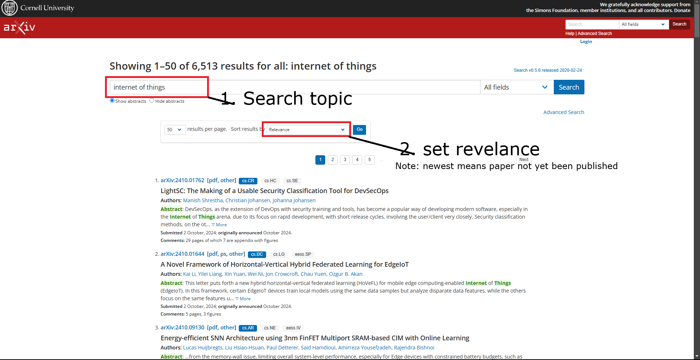
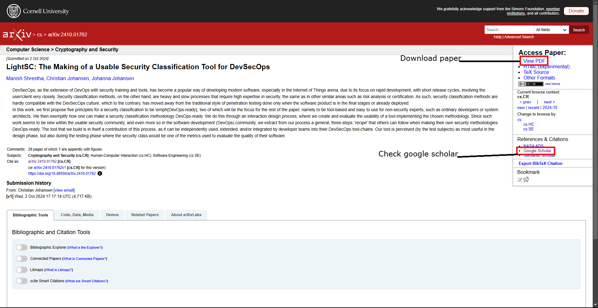
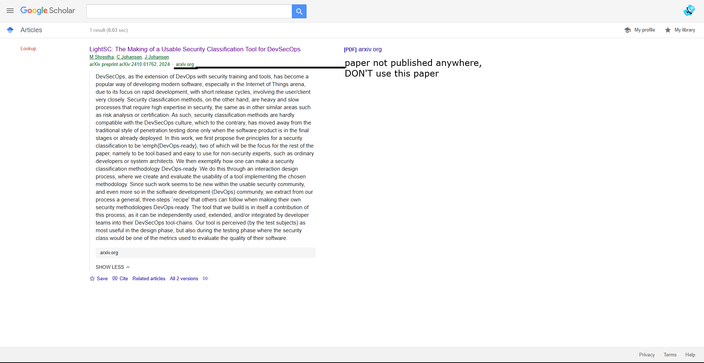

1. Literature survey
2. Gathering paper
3. Literature review tools

---

 

### 1. Literature survey

What is literature survey: Literature survey means gathering information on th research that has _already been conducted_ on a particular topic

                        or

A literature survey is finding out combination of relevant **review papers** and **research paper**

1. Review paper:

   - you wont find novel method/proposal dealing with problem
   - you will find survey conducted by researcher on particular area

2. Research paper:

   - you will find novel method/proposal dealing with problem

 

### 2. Gathering paper

Note: some paper can be downloaded some can't

 

[Google Scholar](https://scholar.google.com/): This will tell us future scope

 

[arxiv](https://arxiv.org/): researcher pre-publish their paper here, so other researcher may not steal their work

 

### 3. Literature review tools

1.
2.
3.
