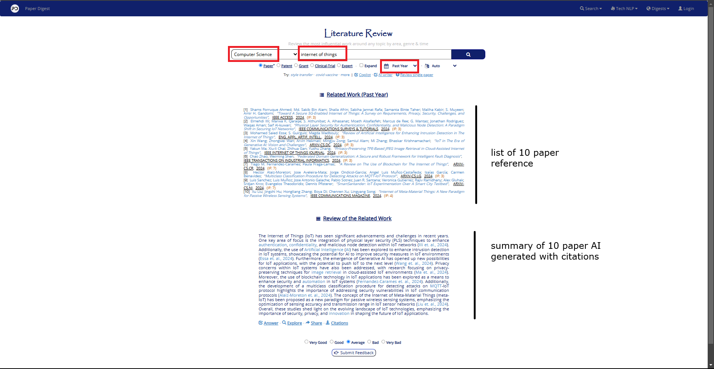

1. Literature survey
2. Gathering paper
3. Literature review tools
4. Paper writing tools
5. Plagiarism check tools
6. Reference and citation management tools
7. Research networking and sharing

---

 

### 1. Literature survey

What is literature survey: Literature survey means gathering information on th research that has _already been conducted_ on a particular topic

                        or

A literature survey is finding out combination of relevant **review papers** and **research paper**

1. Review paper:

   - you wont find novel method/proposal dealing with problem
   - you will find survey conducted by researcher on particular area

2. Research paper:

   - you will find novel method/proposal dealing with problem

 

### 2. Gathering paper

Note: some paper can be downloaded some can't

 

[Google Scholar](https://scholar.google.com/): This will tell us future scope

 

[arxiv](https://arxiv.org/): researcher pre-publish their paper here, so other researcher may not steal their work

 

### 3. Literature review tools

1. [paperdigest](https://www.paperdigest.org/): The AI-powered research platform to write, review, get answers and more
2. [elicit](https://elicit.com/): Analyze research papers at superhuman speed. Automate time-consuming research tasks like summarizing papers, extracting data, and synthesizing your findings
3. [chatpdf](https://www.chatpdf.com/?utm_source=google&utm_medium=cpc&utm_campaign=20999309892&utm_term=chatpdf&utm_content=690282409633&device=c&matchtype=e&network=g&adposition=&gclid=Cj0KCQjwm5e5BhCWARIsANwm06gkjnHaob8o52urjfWAaaN4aHJ8fs-ftTu6hkAMh7RejRGuk6xrYL8aAhwrEALw_wcB&gad_source=1): Elevate Study with AI-Driven PDF Analysis & Instant Summaries for Academic Excellence. ChatPDF Analyzes PDFs, Delivers Concise Summaries
   - upload research papers and AI will generate summary
   - ask question based on paper AI will generate answers
   - prompt "create summary of 200 words"
4. [consensus](https://consensus.app/): Consensus is a new breed of academic search engine, powered by AI, grounded in science. Find the best papers while getting instant insights and topic

 

### 4. Paper writing tools

1. [trinka](https://www.trinka.ai/): Trinka AI is a privacy-first English grammar checker and language enhancement writing assistant designed for academic and technical writing.
1. [quillbot](https://quillbot.com/): Paraphrase Generator. Online Paraphrasing Tool.
1. [paperpal](https://paperpal.com/home): AI Precision for Researchers — Elevate your studies with AI-enhanced research. Embrace AI's role in research evolution. Propel your research into the AI era

 

### 5. Plagiarism check tools

1. [plag](https://www.plag.ai/): Plagiarism checker - Plag.ai plagiarism checker.
1. [turnitin](https://www.turnitin.com/):
1. [enago](https://www.enago.com/): Enago offers expert English editing with a team of 3,000+ PhD/Master's editors averaging 19.4 years of experience

 

### 6. Reference and citation management tools

1. [mybib](https://www.mybib.com/): Automatically create bibliographies, references, and citations in APA, MLA, Chicago, Harvard, and more with our fast and free citation generator.
   - put doi of any paper to generate biblography with different style

### 7. Research networking and sharing

1. ResearchGate: professional network for researcher
2. Academia.edu: share and discover acdemic research
3. Linkedin: Networking platform with many academic groups and discussion
